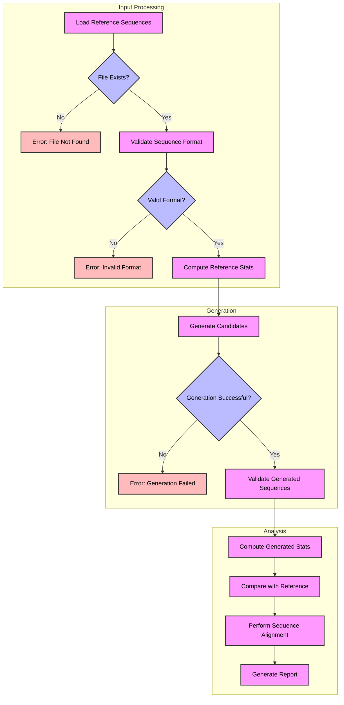

# Aptamer Generator

## Description

The **aptamer-generator** package is a Python tool for generating candidate aptamer sequences, which are short, single-stranded DNA or RNA molecules capable of binding to specific molecular targets. It generates random sequences, scores them based on GC content (optimal at 40-60%) and repetitiveness, and outputs them in a structured format. The package is inspired by computational tools like [AptaDesign](https://github.com/JuanCRueda/AptaDesign) and [RaptGen](https://www.nature.com/articles/s43588-022-00249-6), which use motif extraction and AI-driven methods for aptamer design.

## Installation

To install the package from GitHub, use:

```bash
pip install git+https://github.com/mhmohona/aptamer-generator.git
```

Alternatively, clone the repository and install locally:

```bash
git clone https://github.com/mhmohona/aptamer-generator.git
cd aptamer-generator
pip install -e .
```


## Usage

### Command-line Example

The package includes an example script to generate aptamer sequences and save them to a file. Run the following command:

```bash
python3 -m examples.usage --num-candidates 10
```

This generates 10 candidate sequences (the numbers can be changed by user as per need) and saves them to `output/aptamers.txt`.


### Configuration

The `Config` class allows customization of sequence generation parameters. Example:

```python
from aptamer_generator import Config, AptamerGenerator

config = Config()
config.update(min_length=30, max_length=50, default_candidates=10)
generator = AptamerGenerator(config)
candidates = generator.generate_candidate_sequences()
```

Available configuration options include:

| Category | Parameter | Description | Default |
|----------|-----------|-------------|---------|
| **CoreConfig** | `min_length` | Minimum sequence length | 20 |
| | `max_length` | Maximum sequence length | 80 |
| | `default_candidates` | Number of sequences to generate | 5 |
| | `random_seed` | Seed for reproducibility | None |
| **SequenceConfig** | `gc_min` | Minimum GC content | 0.3 |
| | `gc_max` | Maximum GC content | 0.7 |
| | `min_repeats` | Minimum repeat length for penalty | 4 |
| | `allowed_nucleotides` | Valid nucleotides | ['A', 'T', 'G', 'C'] |
| **OutputConfig** | `output_dir` | Output directory | "output" |
| | `file_format` | Output file format | "fasta" |
| | `verbose` | Enable verbose output | False |
| | `overwrite` | Allow overwriting files | False |

## How It Works

The `AptamerGenerator` class generates random DNA sequences with lengths between `min_length` and `max_length`. Each sequence is scored based on:

- **GC Content Score**: Calculated as `1 - abs(0.5 - gc_content)`, favoring sequences with 40-60% GC content for optimal stability and binding.
- **Repetitive Score**: Penalizes sequences with repetitive 4-nucleotide subsequences to ensure diversity, computed as `max(0.1, 1 - (repeats / (n-3)))`.

The final score is the product of these scores, and sequences are sorted in descending order by score. The approach draws inspiration from tools like [AptaDesign](https://github.com/JuanCRueda/AptaDesign), which uses motif extraction, and [RaptGen](https://www.nature.com/articles/s43588-022-00249-6), which employs AI-driven sequence generation.

## Output Format

Generated aptamers are saved to `output/aptamers.txt` in the following format:

```
Candidate 1:
Sequence: CTGAGTTCGCCCGGATGCTTATTTT
Length: 25
Score: 0.980
--------------------------------------------------
Candidate 2:
Sequence: GGGGCTTTAGGATAAACATGGCATCGGTAGGCCGGTAACCTCGGTGCAAGCGACCAACTTCTTGGGATCGGGAGGTGCA
Length: 79
Score: 0.661
--------------------------------------------------
...
```

The output format can be configured to FASTA via the `file_format` parameter.


## Testing

The package includes tests to verify functionality. Run them using:

```bash
pytest
```

Tests are located in the `tests/` directory, covering sequence generation, scoring, and utility functions.


## Example Dataset

The `examples/thrombin_aptamers.fasta` file provides a sample dataset for validating and banchmarking.

## Validation Results

The package has been validated using a set of thrombin-binding aptamer sequences. Recent validation results show:


Here is a diagram of the validation workflow:



The validation results shows that the package successfully generates sequences that match the reference dataset's characteristics, with alignment scores indicating good similarity between generated and reference sequences.

## Inspiration

This package is inspired by computational tools for aptamer design, including:

- [AptaDesign](https://github.com/JuanCRueda/AptaDesign): A Python tool for in silico aptamer design using motif extraction and directed evolution.
- [RaptGen](https://www.nature.com/articles/s43588-022-00249-6): An AI-powered tool using variational autoencoders for aptamer generation.
